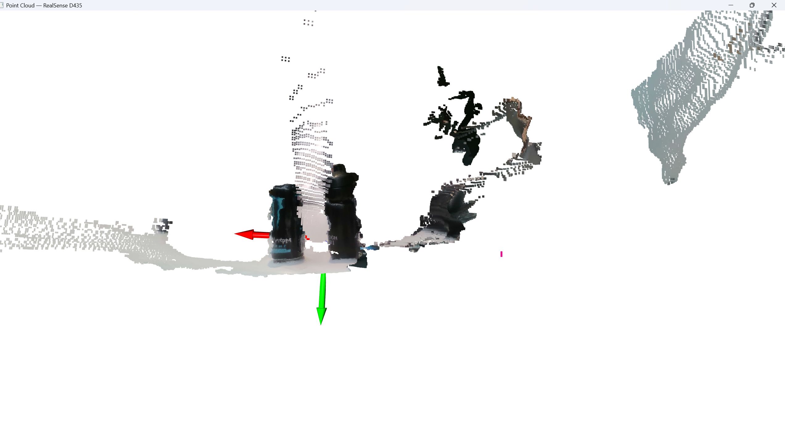

# Phase 0 — Camera Basics: Depth Imaging and Point Clouds

## Overview

Before building any robotics pipeline, we need to understand the raw data the camera produces and how to work with it in Python. This phase covers:

1. Capturing aligned RGB and depth frames from the RealSense D435
2. Understanding what depth data actually means
3. Converting a depth image into a 3D point cloud from scratch
4. Visualising the point cloud live with Open3D

---

## The Intel RealSense D435

The D435 is a **stereo depth camera**. It has three sensors on the front:

- **Left and right IR (Infrared) cameras** — these capture the same scene from slightly different angles (like your two eyes). By comparing how much the same point has shifted between the two images, it calculates how far away that point is. This is called **stereo disparity**.
- **An IR projector** — projects a pattern of dots onto the scene to help the stereo cameras find matching points in low-texture areas (plain walls, floors).
- **An RGB (Red, Green, Blue) camera** — a standard colour camera, used alongside the depth for perception tasks.

The result is two streams: a **colour image** and a **depth image**, where every pixel in the depth image stores the distance to that point in millimetres.

---

## Depth-Colour Alignment

The RGB camera and the depth cameras are physically in slightly different positions on the device. This means a pixel at coordinate (x, y) in the colour image does not naturally correspond to the same (x, y) in the depth image. They are looking at the scene from slightly different viewpoints.

To fix this, the RealSense SDK (Software Development Kit) provides an **alignment** step:

```python
align = rs.align(rs.stream.color)
frames = align.process(frames)
```

This warps the depth image so that every pixel aligns with the colour image. After this, pixel (320, 240) in the colour image and pixel (320, 240) in the depth image refer to the exact same point in the scene. This is essential for any task that combines colour and depth data.

---

## Camera Intrinsics

Every camera has a set of numbers called **intrinsic parameters** that describe its geometry:

| Parameter | Meaning |
|-----------|---------|
| `fx` | Focal length in the horizontal direction (pixels) |
| `fy` | Focal length in the vertical direction (pixels) |
| `cx` | Horizontal coordinate of the image centre (pixels) |
| `cy` | Vertical coordinate of the image centre (pixels) |

These come from the **pinhole camera model** — the mathematical model of how a 3D point in the world projects onto a 2D image sensor.

We read these directly from the camera after starting the stream:

```python
profile = self.pipeline.start(config)
color_stream = profile.get_stream(rs.stream.color)
self.intrinsics = color_stream.as_video_stream_profile().get_intrinsics()
```

---

## The Pinhole Camera Model

This is the core equation that connects 2D image pixels to 3D real-world coordinates. Given a pixel at position (u, v) with depth z (in metres):

```
X = (u - cx) * z / fx
Y = (v - cy) * z / fy
Z = z
```

**Intuition:** The pixel (u, v) is an offset from the image centre (cx, cy). The further a pixel is from centre, the more it represents an angular deviation from the camera's forward direction. Dividing by the focal length (fx, fy) converts that pixel offset into an angle, and multiplying by z converts the angle into a real-world distance.

This is called **back-projection** — going from 2D image coordinates back to 3D space.

---

## What is a Point Cloud?

A **point cloud** is simply a list of 3D points: `[(x1,y1,z1), (x2,y2,z2), ...]`

By applying back-projection to every pixel in the depth image, we get one 3D point per pixel — a full 3D snapshot of the scene. For a 640×480 image, that is 307,200 points. Each point can also carry a colour value taken from the aligned colour image.

Point clouds are the native representation for 3D data in robotics. They are what SLAM algorithms, object detectors, and path planners all work with.

---

## Code

### `realsense_depth.py` — Camera wrapper

Handles camera initialisation, depth-colour alignment, and intrinsics:

```python
self.align = rs.align(rs.stream.color)
profile = self.pipeline.start(config)
color_stream = profile.get_stream(rs.stream.color)
self.intrinsics = color_stream.as_video_stream_profile().get_intrinsics()
```

The `get_frames()` method returns aligned colour and depth frames on every call.

### `pointcloud_viewer.py` — Live 3D visualiser

The `depth_to_pointcloud()` function applies the pinhole back-projection equation to every pixel:

```python
z = depth_image / 1000.0          # millimetres → metres
x = (u - cx) * z / fx
y = (v - cy) * z / fy
```

The Open3D visualiser updates in real time using a non-blocking loop. A key implementation detail: the point cloud object must be updated **in-place** rather than reassigned, because the visualiser holds a reference to the original object:

```python
pcd.points = o3d.utility.Vector3dVector(points)   # correct — updates in place
pcd.colors = o3d.utility.Vector3dVector(colors)
vis.update_geometry(pcd)
```

Reassigning `pcd` to a new object breaks the visualiser's reference and nothing updates.

---

## Setup

### Requirements

```
pip install pyrealsense2 open3d numpy opencv-python
```

> **Note:** Install `pyrealsense2` via pip, not via the Intel apt repository. The apt repository requires manual GPG key management and is more fragile on newer Ubuntu versions.

### Running

```bash
# Live depth + colour feed
python realsense_depth.py

# Live 3D point cloud
python pointcloud_viewer.py
```

Plug in the D435 via USB 3.0 before running.

---

## Results



The screenshot above shows a live point cloud of a desk scene — a water bottle, energy can, and the RealSense box captured in 3D. The coordinate axes at the origin show the camera's coordinate frame: **X (red) = right, Y (green) = down, Z (blue) = forward into the scene**.

- **Depth feed:** Each pixel displays distance as a colour gradient. Nearby objects appear warm (red/orange), distant objects appear cool (blue). Invalid depth pixels (no return signal) appear black.
- **Point cloud:** A live 3D reconstruction of the scene updates several times per second. Moving the camera causes the entire point cloud to shift in real time. Objects at different depths are clearly separated in 3D space.
- **Dark surface limitation:** Black or very dark objects absorb the infrared light the D435 uses for depth sensing, resulting in sparse or missing points on those surfaces. This is a known physical property of structured-light/stereo IR depth cameras, not a software issue.

---

## Key Takeaways

- The D435 produces depth by comparing two infrared views of the same scene (stereo disparity)
- Depth and colour frames must be aligned before combining them
- Camera intrinsics (fx, fy, cx, cy) are the bridge between 2D pixels and 3D coordinates
- Back-projection turns a depth image into a point cloud using four arithmetic operations per pixel
- A point cloud is just a list of (x, y, z) coordinates, the simplest possible 3D representation

---

*Next: [Phase 1 — ROS2 Setup](../phase1_ros2_setup/) — publishing camera data as ROS2 topics so any node in the system can consume it.*
