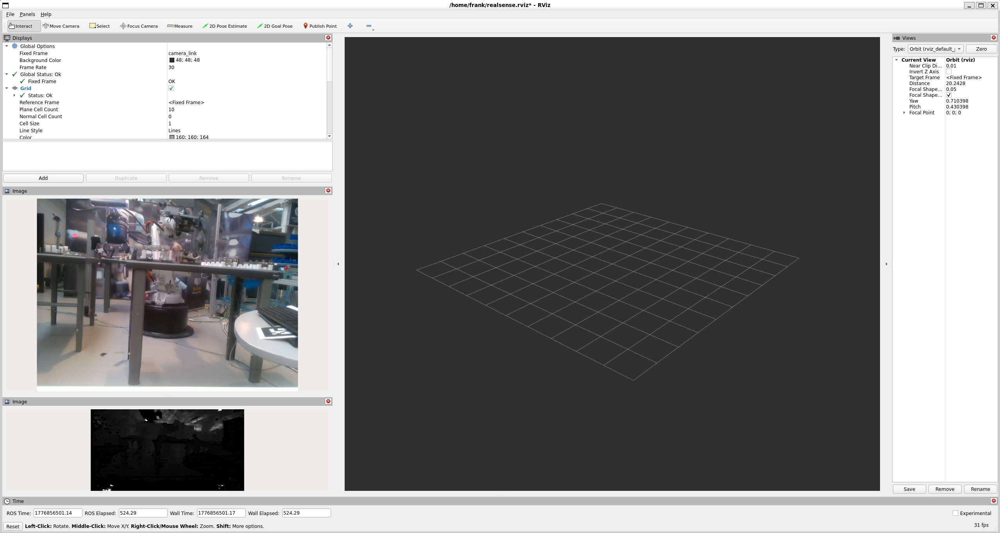

# Phase 1 — ROS2 Pipeline: Getting Camera Data into ROS2

## Overview

In Phase 0 we read directly from the camera in Python. That works for a single script, but real robots run many programs simultaneously, for instance a camera driver, a SLAM algorithm, an object detector, a path planner, a motor controller and so on. They all need to share data. Writing custom networking code between every pair of programs would be a nightmare.

**ROS2 (Robot Operating System 2)** solves this. It is a middleware framework that lets separate programs communicate over a standard interface, without any program needing to know who else is running or listening.

---

## Core ROS2 Concepts

### Node
A **node** is a single running program. Examples:
- A camera driver node that reads frames and publishes them
- A SLAM node that subscribes to frames and builds a map
- A path planner node that subscribes to the map and publishes motor commands

Nodes are independent processes. They can be written in different languages, run on different machines, and started or stopped at any time without affecting other nodes.

### Topic
A **topic** is a named data channel. Any node can publish data to a topic; any node can subscribe to a topic. The publisher does not know who is subscribed, and the subscriber does not know who is publishing. This decoupling is the central design principle of ROS2.

Example topics from the RealSense driver:
```
/camera/camera/color/image_raw          ← RGB (Red, Green, Blue) frames
/camera/camera/depth/image_rect_raw     ← raw depth frames
/camera/camera/aligned_depth_to_color/image_raw  ← depth aligned to colour
/camera/camera/color/camera_info        ← camera intrinsics
```

### Message
A **message** is the data type sent over a topic. ROS2 defines standard message types for common data:
- `sensor_msgs/Image` — a camera frame
- `sensor_msgs/CameraInfo` — camera intrinsics (fx, fy, cx, cy)
- `nav_msgs/OccupancyGrid` — a 2D map
- `geometry_msgs/PoseArray` — a list of 3D poses

Using standard types means any ROS2-compatible tool (SLAM libraries, visualisers, navigation stacks) can consume your data without modification.

### Why This Architecture Matters
With ROS2 running, you can open `rqt_image_view` and see the camera feed without changing a single line of the camera driver. You can run a SLAM node alongside a pose estimation node alongside a path planner, all reading from the same camera topic simultaneously. 

---

## Platform Setup: Windows 11 + WSL2

ROS2 runs natively on Linux. On Windows, we use **WSL2 (Windows Subsystem for Linux 2)** . This is a full Linux kernel running inside Windows, with near-native performance.

### Why WSL2 and not a VM?
- WSL2 shares the Windows file system (`/mnt/c/`), hence easy to move files between Windows and Linux
- Lower overhead than a virtual machine
- Native terminal integration with Windows Terminal

### Step 1 — Enable WSL2 and install Ubuntu

In PowerShell (as Administrator):
```powershell
wsl --install
```

This installs WSL2 and Ubuntu 22.04 by default. Restart when prompted. On first launch, create a username and password for Ubuntu.

Verify WSL2 is running:
```powershell
wsl --list --verbose
```
You should see `Ubuntu-22.04` with `VERSION 2`.

### Step 2 — Install ROS2 Humble inside WSL2

Open Ubuntu and run:

```bash
# Set locale
sudo apt update && sudo apt install -y locales
sudo locale-gen en_US en_US.UTF-8
sudo update-locale LC_ALL=en_US.UTF-8 LANG=en_US.UTF-8

# Add ROS2 apt repository
sudo apt install -y software-properties-common curl
sudo curl -sSL https://raw.githubusercontent.com/ros/rosdistro/master/ros.key \
    -o /usr/share/keyrings/ros-archive-keyring.gpg
echo "deb [arch=$(dpkg --print-architecture) \
    signed-by=/usr/share/keyrings/ros-archive-keyring.gpg] \
    http://packages.ros.org/ros2/ubuntu \
    $(. /etc/os-release && echo $UBUNTU_CODENAME) main" \
    | sudo tee /etc/apt/sources.list.d/ros2.list

# Install ROS2 Humble desktop
sudo apt update
sudo apt install -y ros-humble-desktop

# Source ROS2 automatically on every terminal open
echo "source /opt/ros/humble/setup.bash" >> ~/.bashrc
source ~/.bashrc
```

### Step 3 — Enable systemd in WSL2

The RealSense camera needs udev rules (Linux device permission rules) to work without running as root. udev requires systemd to be running.

Edit `/etc/wsl.conf` (create it if it doesn't exist):
```
[boot]
systemd=true
```

Then restart WSL2 from PowerShell:
```powershell
wsl --shutdown
```

Reopen Ubuntu. The systemd is now active.

---

## USB Passthrough: usbipd-win

WSL2 does not have USB (Universal Serial Bus) access by default. USB devices are connected to Windows, not to the Linux kernel inside WSL2. We use **usbipd-win** to forward the camera's USB connection into WSL2.

### Install usbipd-win (Windows, one time)

Download and install from: https://github.com/dorssel/usbipd-win/releases

### Forward the camera every session

**In PowerShell (as Administrator) on Windows:**
```powershell
# List all USB devices and find the RealSense
usbipd list

# Attach it to WSL2 (replace 1-18 with your actual bus ID from the list above)
usbipd attach --wsl --busid 1-18
```

> **Important:** This must be re-run every time you restart WSL2 or replug the camera. The bus ID (e.g. `1-18`) may change if you replug into a different USB port.

**In Ubuntu, verify the camera is visible:**
```bash
lsusb | grep Intel
# Should show: Intel Corp. RealSense ...
```

---

## Install the RealSense ROS2 Driver

```bash
sudo apt install -y ros-humble-realsense2-camera
```

This installs `realsense2_camera`, a ROS2 node that reads from the D435 and publishes all camera streams as ROS2 topics automatically.

---

## Running the Pipeline

**Terminal 1 — Start the camera node:**
```bash
ros2 launch realsense2_camera rs_launch.py \
    align_depth.enable:=true \
    pointcloud.enable:=true
```

The `align_depth.enable:=true` flag is critical, it activates the aligned depth topic, which ensures RGB and depth frames have matching timestamps and pixel coordinates.

**Terminal 2 — View the camera feed:**
```bash
rqt_image_view
```

In the dropdown, select `/camera/camera/color/image_raw` to see the RGB feed, or `/camera/camera/aligned_depth_to_color/image_raw` for the depth feed.

**Terminal 3 — List all active topics:**
```bash
ros2 topic list
```

**Check data is flowing:**
```bash
ros2 topic hz /camera/camera/color/image_raw
# Should report ~30 Hz (Hertz — frames per second)
```

---

## rqt_image_view vs cv2.imshow

In Phase 0 we used `cv2.imshow` to display images. In WSL2 this is unreliable — the display forwarding between Linux and Windows can drop frames or show a black screen.

`rqt_image_view` is a ROS2 tool that subscribes to any `sensor_msgs/Image` topic and displays it as a live video feed. It is:
- Decoupled from the publishing node — the camera driver publishes, rqt subscribes independently
- Reliable in WSL2 environments
- Demonstrates a core ROS2 principle: the publisher does not know or care who is watching

This pattern — publish to a topic, view with a separate tool — is how all ROS2 visualisation works.

---

## Results



RViz2 showing the live RGB feed (top panel) and raw depth feed (bottom panel) from the D435 publishing through ROS2. The RGB feed shows a robotics lab environment. The depth panel appears dark because RViz2 renders raw 16-bit depth values (stored in millimetres) directly — the data is correct but requires colorisation to be visually interpretable.

The active topics at this point:

```
/camera/camera/color/image_raw               ← RGB frames at 30 Hz
/camera/camera/aligned_depth_to_color/image_raw  ← Depth aligned to colour
/camera/camera/color/camera_info             ← Intrinsics (fx, fy, cx, cy)
/camera/camera/depth/image_rect_raw          ← Raw depth frames
/tf_static                                   ← Coordinate frame transforms
```

Any other node or tool in the system can subscribe to these topics without modifying the camera driver. This is the foundation that all subsequent phases build on.

---

*Next: [Phase 2 — Occupancy Grid](../phase2_occupancy_grid/) — converting the depth stream into a 2D navigation map.*
