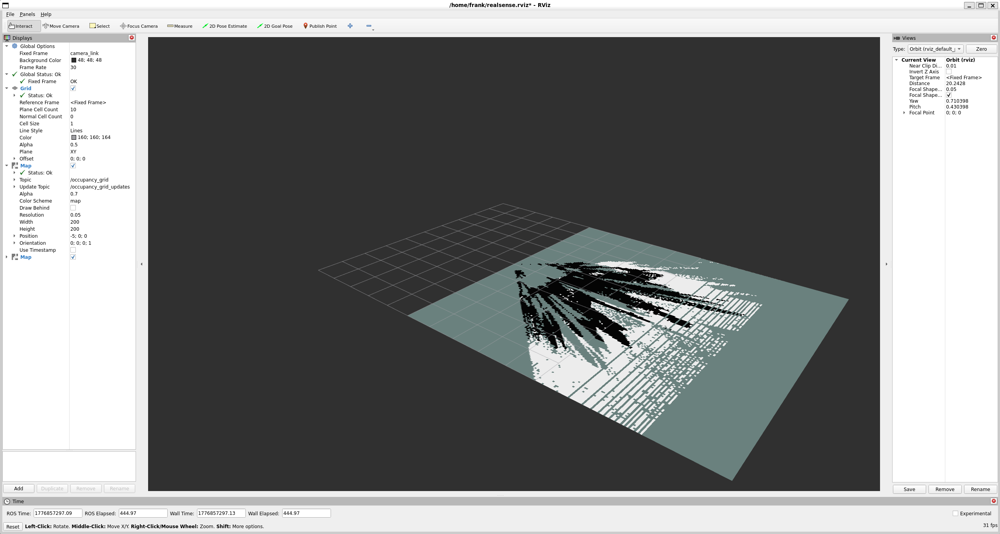

# Phase 2 — Occupancy Grid: Building a 2D Navigation Map

## Overview

A robot navigating a room needs to know two things: where obstacles are, and where it can safely move. The standard representation for this in robotics is an **occupancy grid**. This is a 2D (two-dimensional) map where each cell is marked as free, occupied, or unknown.

In this phase we take the depth stream from Phase 1 and convert it into a live occupancy grid, published as a standard ROS2 message that the Nav2 navigation stack can consume directly.

---

## What is an Occupancy Grid?

An occupancy grid divides the floor area into a regular grid of square cells. Each cell stores one of three values:

| Value | Meaning |
|-------|---------|
| 0 | Free — confirmed no obstacle here |
| 100 | Occupied — obstacle detected |
| -1 | Unknown — no depth data for this area |

The ROS2 standard message type is `nav_msgs/OccupancyGrid`. It stores the grid as a flat array of integers, along with metadata: the cell size (resolution in metres), the grid dimensions (width × height in cells), and the origin (position of the bottom-left corner in real-world coordinates).

This format is used directly by **Nav2 (Navigation 2)**, ROS2 (Robot Operating System 2)'s standard navigation stack which uses the occupancy grid to plan collision-free paths.

---

## From Depth Image to 2D Map: The Pipeline

### Step 1 — Back-project depth pixels to 3D points

We already know this from Phase 0. Using the pinhole camera model and the camera intrinsics, every depth pixel (u, v, z) becomes a 3D point (X, Y, Z) in camera space:

```
X = (u - cx) * z / fx
Y = (v - cy) * z / fy
Z = z
```

This gives us a full point cloud of the scene.

### Step 2 — Height filtering

Not every 3D point represents a navigation obstacle. The floor is not an obstacle. The ceiling is not an obstacle. We only want points at **obstacle height**. These are things a robot would actually collide with.

We filter by the Y axis (vertical in camera coordinates):

```python
mask = (z > 0.1) & (z < 5.0)          # valid depth range
height_mask = (y > 0.1) & (y < 1.5)   # between 10cm and 150cm above ground
```

- Points below 0.1m: the floor — ignored
- Points above 1.5m: ceiling / tops of tall objects — ignored
- Points in between: potential obstacles — kept

### Step 3 — Project to 2D

We discard the Y (height) coordinate and project the remaining points onto the X-Z plane — the top-down view of the scene. Each (X, Z) coordinate is converted to a grid cell index:

```python
grid_x = int((X / resolution) + grid_width  / 2)
grid_z = int((Z / resolution))
```

The resolution is typically 0.05m per cell (5 cm). Every cell that receives at least one point is marked occupied (100). All other cells within the camera's field of view are marked free (0).

---

## Important Limitation: No Accumulation

This occupancy grid shows only what is **currently visible** in the camera frame. As soon as the camera pans away from an area, that area returns to unknown. The grid does not remember previous observations.

This is a fundamental limitation of single-frame mapping. To build a persistent map that accumulates observations over time (remembering obstacles even after the camera has moved away) you need **SLAM** (Phase 3).

The single-frame grid is still useful for:
- Real-time obstacle detection directly in front of the robot
- As input to reactive avoidance behaviours
- As a stepping stone to understanding what SLAM needs to solve

---

## Code: `occupancy_grid_node.py`

The node subscribes to two topics:

```
/camera/camera/aligned_depth_to_color/image_raw   ← depth frames
/camera/camera/color/camera_info                  ← intrinsics (fx, fy, cx, cy)
```

And publishes to:
```
/occupancy_grid    ← nav_msgs/OccupancyGrid
```

The main processing loop runs on every incoming depth frame:

1. Convert raw depth (uint16, millimetres) to float metres
2. Back-project to 3D using intrinsics
3. Apply height filter
4. Project surviving points onto 2D grid
5. Pack into `nav_msgs/OccupancyGrid` message and publish

The aligned depth topic is used (not raw depth) to ensure the depth and colour frames share the same camera coordinate system and intrinsics.

---

## Setup

This node is part of the `depth_nav` ROS2 package.

```bash
cd ~/ros2_ws
colcon build --packages-select depth_nav
source install/setup.bash
```

**Terminal 1 — Start the camera:**
```bash
ros2 launch realsense2_camera rs_launch.py align_depth.enable:=true
```

**Terminal 2 — Run the occupancy grid node:**
```bash
ros2 run depth_nav occupancy_grid_node
```

**Terminal 3 — Visualise the grid in RViz2:**
```bash
rviz2
```

In RViz2: Add → By topic → `/occupancy_grid` → Map. Set Fixed Frame to `camera_link`.

---

## Results



The screenshot shows the live occupancy grid of a robotics lab scene. The teal area is free space (camera can see it, no obstacles within the height filter range). The dark/black cells are occupied — in this case the structure of a robot arm and surrounding equipment detected as obstacles. The grid updates in real time at 30 Hz as the camera moves.

- **Teal** — free space: the camera sees this area and found no obstacles at the filtered height
- **Black/white** — occupied: points detected between 0.1 m and 1.5 m above the ground plane
- **Dark background** — unknown: outside the camera's field of view

The grid does not accumulate between frames — each frame is a fresh snapshot. This is by design for single-camera navigation. Persistent mapping requires SLAM, covered in Phase 3.

---

## Key Takeaways

- An occupancy grid is the standard 2D map format in robotics navigation
- Height filtering is essential: without it, the floor itself would appear as an obstacle
- Back-projection connects Phase 0 (point clouds) to Phase 2 (maps) — the same maths, applied differently
- Single-frame grids have no memory — SLAM is needed for persistent mapping

---

*Next: [Phase 3 — Visual SLAM](../phase3_slam/) — building a persistent 3D map by accumulating observations as the camera moves.*
