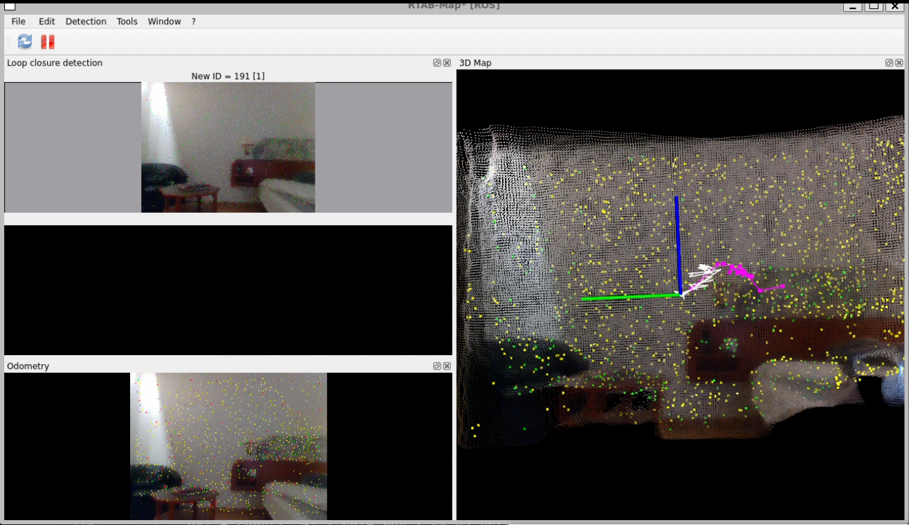
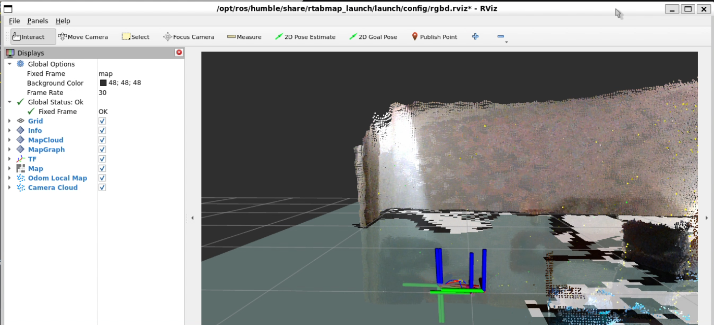

# Phase 3 — Visual SLAM: Building a Persistent 3D Map

## Overview

Phase 2 produced an occupancy grid that only showed the current camera view. As soon as the camera moved, old observations were forgotten. For a robot to navigate a real environment, it needs a **persistent map** that accumulates over time, and it needs to know **where it is within that map** at every moment.

This is the SLAM problem.

---

## What is SLAM?

**SLAM** stands for Simultaneous Localisation and Mapping. It is the problem of:

1. **Mapping** — building a map of an unknown environment
2. **Localisation** — figuring out where you are within that map

The challenge is that these two problems depend on each other. To build an accurate map, you need to know where you are. To know where you are, you need a map. SLAM algorithms solve both simultaneously.

This is considered one of the core unsolved problems in robotics, not because it is impossible, but because doing it robustly in all conditions (dynamic scenes, poor lighting, fast motion, loop revisits) is genuinely hard.

---

## Visual Odometry: Estimating Camera Motion

The first component of SLAM is **visual odometry**; estimating how the camera has moved between frames by tracking visual features.

The idea: identify distinctive points (corners, edges, texture patches) in frame N. Find the same points in frame N+1. From how they shifted across the image, calculate the camera's rotation and translation between the two frames. Accumulate these frame-to-frame movements to estimate the camera's trajectory.

This is like dead reckoning for a camera :),  always estimating position relative to where you just were. The problem is that small errors accumulate over time, causing **drift**: the estimated trajectory slowly diverges from the true trajectory.

---

## Loop Closure: Correcting Drift

The key technique for correcting drift is **loop closure**: recognising when the camera has returned to a previously visited location, and using that recognition to correct the accumulated error.

When the SLAM system detects that the current view matches a stored keyframe from earlier in the session, it computes the discrepancy between where it thinks it is (based on odometry) and where it should be (based on the recognised location). It then applies a correction that propagates back through the entire trajectory, pulling the map into a globally consistent shape.

This is why SLAM systems improve noticeably when you deliberately revisit areas. Each loop closure tightens the map.

---

## RTAB-Map

Rather than implementing visual odometry and loop closure from scratch, we used **RTAB-Map** (Real-Time Appearance-Based Mapping); a production-grade, open-source SLAM library with full ROS2 integration.

RTAB-Map is used in real research robots and commercial systems. It handles:
- Visual and RGB-D (Red, Green, Blue - Depth) odometry
- Loop closure detection using bag-of-words visual similarity
- 3D point cloud map building
- 2D occupancy grid generation from 3D maps
- Large-scale mapping with memory management

### Our Contribution

We did not write the SLAM algorithm. Our work was the **integration layer**:

1. **Topic remapping** — connecting the camera's topic names to the names RTAB-Map expects
2. **Parameter tuning** — finding settings that work reliably with the D435 at typical indoor distances
3. **Debugging the depth sync issue** — identifying and fixing the RGB/depth timestamp mismatch

This is a realistic representation of how SLAM is used in industry: production-grade libraries handle the algorithm, and engineers handle the integration.

---

## Key Parameters

| Parameter | Value | Why |
|-----------|-------|-----|
| `Vis/MinInliers` | 10 | Minimum feature matches needed to accept an odometry estimate. Lower values allow tracking in low-texture scenes; too low causes false matches. |
| `Odom/Strategy` | 1 | Frame-to-Map odometry. Each new frame is matched against a local map of recent keyframes, not just the previous single frame. More robust to fast motion. |
| `OdomF2M/MaxSize` | 2000 | Maximum number of 3D points kept in the local odometry map. Larger = more robust but more CPU (Central Processing Unit) usage. |

---

## The Depth Sync Problem

The D435 streams RGB at 640×480 and depth at 848×480 by default. Different resolutions. RTAB-Map requires RGB and depth frames to have matching timestamps to compute accurate depth at each colour pixel.

Without alignment, RTAB-Map would log `did not receive data` errors and refuse to start.

**Fix:** launch the camera with `align_depth.enable:=true`. This activates the aligned depth topic (`/camera/camera/aligned_depth_to_color/image_raw`), which resamples the depth stream to match the colour resolution and synchronises timestamps. We subscribe to this topic throughout all subsequent phases for the same reason.

---

## Setup

### Install RTAB-Map

```bash
sudo apt install -y ros-humble-rtabmap-ros
```

### Running

**Terminal 1 — Start the camera with alignment enabled:**
```bash
ros2 launch realsense2_camera rs_launch.py \
    align_depth.enable:=true \
    pointcloud.enable:=true
```

**Terminal 2 — Start RTAB-Map:**
```bash
ros2 launch rtabmap_launch rtabmap.launch.py \
    rgb_topic:=/camera/camera/color/image_raw \
    depth_topic:=/camera/camera/aligned_depth_to_color/image_raw \
    camera_info_topic:=/camera/camera/color/camera_info \
    frame_id:=camera_link \
    approx_sync:=false \
    --Vis/MinInliers 10 \
    --Odom/Strategy 1 \
    --OdomF2M/MaxSize 2000
```

**Terminal 3 — Visualise:**
```bash
rviz2
```

Add a `PointCloud2` display subscribed to `/rtabmap/cloud_map` to see the 3D map build in real time.

### Tips for Good Results

- **Move slowly** — visual odometry loses tracking if the camera moves faster than features can be matched between frames
- **Keep scenes well lit** — dark or featureless areas reduce the number of trackable features
- **Revisit areas** — deliberately return to places you have already mapped to trigger loop closure and tighten the map
- **Avoid pointing directly at plain walls** — flat, textureless surfaces give odometry almost no features to track

---

## Results

### RTAB-Map — Loop Closure and 3D Feature Map



The RTAB-Map window shows three panels:
- **Loop closure detection** (top-left) — the image from a previously visited location that was recognised. `New ID = 191 [1]` means 191 keyframes accumulated and 1 loop closure detected
- **3D Map** (right) — the accumulated point cloud with yellow feature points tracked across frames. The pink line is the camera trajectory; the blue/green axes show the current camera pose
- **Odometry** (bottom-left) — the live camera view with feature points overlaid, showing active tracking

### RViz2 — Dense 3D Reconstruction



The RViz2 view shows the dense coloured point cloud map accumulated as the camera moved through the room. The wall structure, floor, and furniture are clearly reconstructed in 3D. The coordinate axes at the camera origin show position and orientation within the map. The teal 2D occupancy grid on the floor is generated automatically by RTAB-Map alongside the 3D map.

The map persists between frames — unlike the occupancy grid in Phase 2 which only showed the current frame. Loop closure corrects accumulated drift when the camera returns to a previously visited location.

---

## Key Takeaways

- SLAM solves the chicken-and-egg problem of needing a map to localise and needing a position to map
- Visual odometry estimates motion frame-by-frame but accumulates drift
- Loop closure detects revisited locations and corrects accumulated drift globally
- RTAB-Map is a production-grade SLAM library; our work was integrating it correctly with the D435
- The aligned depth topic (`aligned_depth_to_color`) is essential for RGB-depth synchronisation

---

*Next: [Phase 4 — Pose Estimation](../phase4_pose_estimation/) — detecting objects and estimating their full 6-DOF pose in 3D.*
